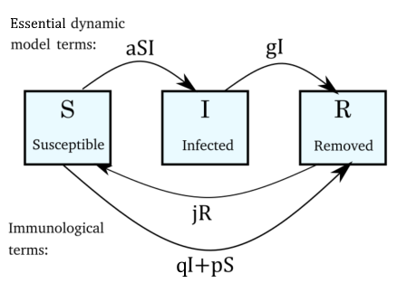

# The S.I.R. model - Dynamics of population immunity 

Stephen Dages - December 2020

Compartmental models are an essential tool for contemporary epidemiologists. The SIR model is a simple but powerful instance of a compartmental model. In this article, the model helps to describe problems with distribution of vaccines. There are dramatically different dynamics depending on whether vaccines are aquired proactively or reactively. Additionally, an analytic method of determining steady-state infection rates fails to anticipate dangerous spikes in infection rates that are observed via numerical solutions. This model may be implemented in other examples of biological population dynamics like forest management modelling. discussion here will concentrate on human diseases such as Covid-19.
## Introduction

##### Discrete model

Discrete models can capture the state of individuals in a population. Epidemics can be simulated stochastically using such a simulation. For large populations, a discrete model requires a great deal of computation. Further, the behavior of these models may be challenging to explain.

##### Compartmental models of epidemics

A compartmental model separates a population into groups of individuals with a common state. In the case of the S.I.R. model, those groups are comprised of those who are Susceptable to infection, those who are Infectious, and those who are Removed. The compartmental model offers acceptable correspondence with more granular discrete stocastic models.

## Model Derivation

##### Figure 0: Schematic

##### Constants

The essential SIR model only uses two parameters, so when that is reffered to, it can be assumed that $j=q=p=0$.

- essential parameters:
    - $a$, infection rate, controllable via behavioral interventions i.e. hygene, or quarantining.
    - $g$, removal rate; models healing with an immune response, or death
- immunological parameters:
    - $j$, immunity loss; for previously infected or replacement population
    - $q$, reactionary vaccination rate; models tendency to inoculate due to awareness of illness.
    - $p$, proactive vaccination rate; models mandates/incentives/marketing for vaccines

Each parameter is greater than zero. If no vaccine is available,  $q$ and $p$ must be zero. The essential model includes no immunological terms.

The system of differential equations becomes:

$$\dot{S}=-a S I- g I-p S+j R$$

$$\dot{I}=a S I-g I$$

$$\dot{R}=g I + q I + p S - j R$$

##### Reparameterize into 2D dynamic system

This system can be simplified for convenience by setting the total population to be another constant parameter.

$$N= S+I+R $$

$$\dot{N}= 0$$

There remains only two degrees of freedom. They can be described by

$$\dot{S}= -aSI -qI -pS+j(N-I-S)$$

$$\dot{I} = aSI -gI$$

##### Assumptions of this S.I.R. model

Note that quarantining is described in this article as being a factor in infection rate. Other models may regard quarantine as a state of removal. Enviromental factors and are ignored. This model is also not chaotic due to only having 2 variables.

###### Population Replacement

If the population is considered to be constant, this could be considered valid if the fatality rate due to the maximum plausible number of infections is low enough to be outpaced by birthrates. Other models incorporate compartments for newborns who would not yet be susceptible to the given illness. 

## Analysis

##### Non-dimensionalization

As a reminder that this is a continuous model, and for convenience, this article sets $$N=1$$

##### Nulclines and fixed points

The nullcline for constant succeptability:

$I=\frac{1-(j+p) s}{(a s+q+j)}$

The nullcline for constant infection rate:

$I=0, \quad S=\frac{g}{a}$

The fixed points can be determined:

$\left(S^{*}=\frac{j}{(j+p)}, I^*={0}\right)$
$\left(S^*=\frac{g}{a}, I^{*}=\frac{j-(j+p) \frac{g}{a}}{(a S+q+j)}\right)$

$\left(\frac{j}{(j+p)},{0}\right)$ $\left(\frac{g}{a},\frac{j-(j+p) \frac{g}{a}}{(a S+q+j)}\right)$

##### R-value

Perhaps the most common starting point for analysis is the $R_0$ value, the ratio of the infection rate to the removal rate (in the non-dimensional form). It is perhaps the most accessible to understand metric of the SIR model and is used to predict the inflection point of an outbreak. If $S$ is greater than $R_0$ then the infections will grow, otherwise they will fall. When the immunological terms are added to the model, this will change slightly, but the "pivot point" will remain at roughly $S=R_0$ for $j,q,p<<R_0$

##### Linearization about fixed points

The jacobian of each fixed point can be determined. The eigenvalues of these matrices can be used to determine the stability of the fixed points in the phase plane.

##### Plausible region of phase plane for various scenarios

Due to the constraint of constant population, it is helpful to restrict the visualization of the phase plane to an issosceles triangle. Also, the following visuals entailnon-dimensionalized version of the model such that the total population is $1$. Phase portraits were generated using Matlab and pplane.

###### Figure 1: Essential model scenario visualization

The fixed points of the system become:

$\left(1,{0}\right)$ $\left(\frac{g}{a},0\right)$

The essential model also allows for a prediction of the total number of infected by using separation of variables. This cannot be done with the extended model. The simple model is also primarily useful when there is a rapidly introduced disease where behavior is minimally affected that would change infection rates. One of the key features of the SIR model is that the number of Infected approaches zero before infecting the entire population.

###### Figure 2: Loss of immunity, No Vaccinations

Within a population there may be a loss of immunity leading to repeated outbreaks. By setting the immunity-loss parameter, $j=0.05$ it is possible to model a disease similar to strain of the common cold. The immunity gained by the first wave of illness decays over time. This may be due to population replacement or individual's loss of immunity. By this mechanism. Old latent diseases can return with severe consequences.

###### Figure 3: Loss of immunity, Reactionary Immunizations

In the case of a diseases for which a vaccine is available, widespread immunization is critical to mitigate spread, ie. keep $S<R_0$. Many people may tend to not worry about getting vaccinations until an outbreak is already occuring. this behavior is modeled by the coefficient, $q$ for reactionary immunization. All else equal, the outbreak peaks at a lower height but it also results in a non-zero steady state infection rate.

###### Figure 4: Loss of immunity, Proactive Immunizations
In this concluding phase diagram, there is a low rate of proactive immunization introduced, $p=0.04$ which helps mitigate outbreaks as they occur and prevent them from happening again.

Sound public health policy must involve either strong marketing, incentives, or mandates to ensure that the public receives available vaccines.

## Sources

##### 1

Steven Strogatz, Nonlinear dynamics and chaos, 2015, *Westview Press*, Boulder Co

##### 2
Howard Weiss, The SIR model and the Foundations of Public Health, 2009, Universitat Autonomo
de Barcelona

##### 3
Kermack McKendrick, Contributions to the mathematical theory of epidemics-I, 1927, *Bulletin of Mathematical Biology*

##### 4
Linda JS Allen, An introduction to stochastic processes with applications to biology, 2003, *Pearson Education* New Jersey

##### 5
Herbert W. Hethcote, The Mathematics of Infectious Diseases, 2000,